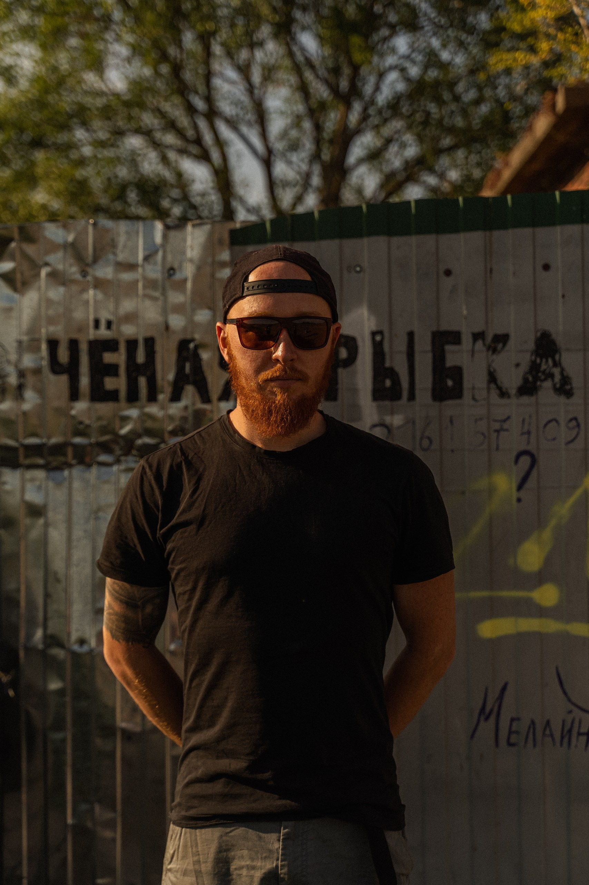

# Хэллоу тебе путник, забредший на эту страницу! 

## Меня зовут Игр, назвали в честь Олимпийских Игр. ##

Я учусь в Нетологии уже **2 месяца** и у меня почти сплавились мозги.

Но есть и плюсы: 
1. *Я получаю полезные навыки*
2. *Я становлюсь востребованее на рынке труда*
3. *Постепенно отхожу от привязки к месту касаемо работы* 

Вот моё фото, будем знакомы! 

Пока что я мало что умею, но если у тебя надется для меня работёнка в сфере IT, то знай что я готов браться за еду и опыт! 

А вообще, если взять сферу IT и меня, то очень подходят слова из трека "Столярочка":
> "Киянка, стаместка, топор и зубило
Я хоть и туп, но я не ~~мудила~~" (С) Кровосток